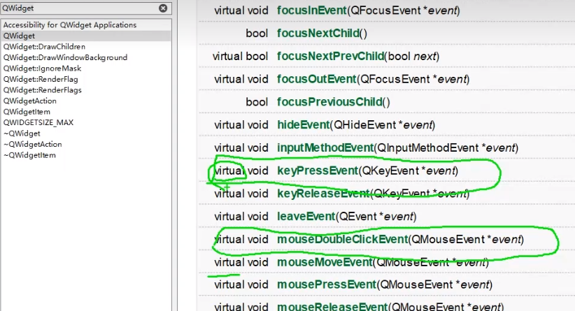
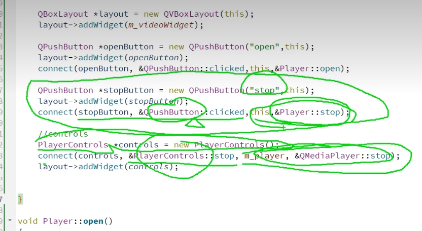
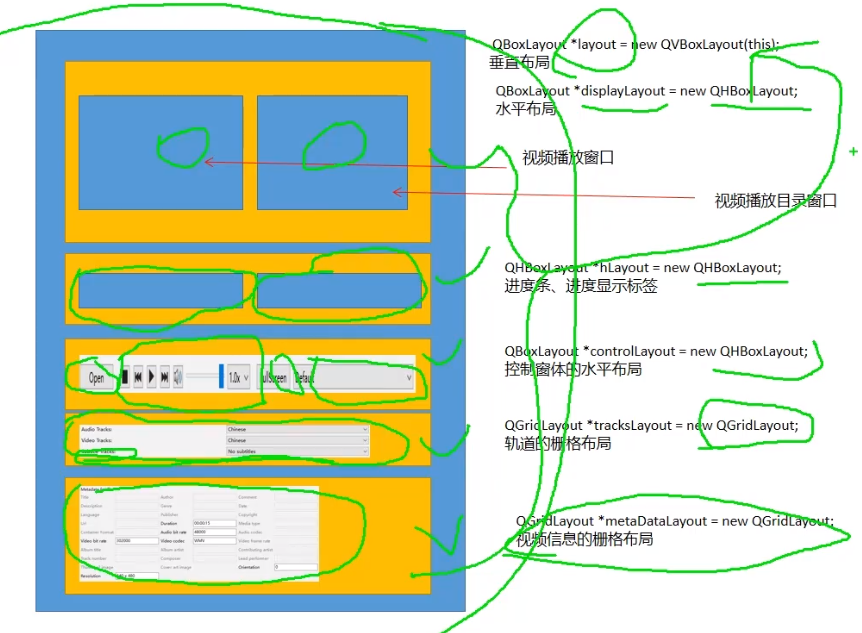

# MyPlayer
1、新建项目myplayer，继承自QWidget，无需ui设计。


2、创建VideoWidget类，将继承自QWidget修改为继承自QVideoWidget，修改相关信息。

```
// 设置窗体尺寸：默认
// 设置调色板
// 设置窗口尺寸
```


3、在player类中播放VideoWidget，将QVideoWidget设为私有成员，通过namespce引入class QVideoWidget；

​	  在player.cpp文件中new一个VideoWidget作为成员。

```
p.setColor(QPalette::Window, Qt::black); // 黑色未显现，但4中双击显现了

解决：
setAutoFillBackground(true);
```


4、VideoWidget事件：双击鼠标全屏或缩小、ESC缩小。




5、添加播放器的音频和视频输出设备；

​	  添加open和stop按钮，并绑定槽函数。

```
Qt5没有m_player->setAudioOutput(m_audioOutput); // 播放器的音频输出设备

Qt5没有m_player->setSource(QUrl::fromLocalFile(aFile));

解决：安装Qt6
```


6、创建PlayControls类；

​	  定义停止按钮、信号；

​	  引入头文件<QToolButton>、 <QStyle>，设置按钮并connect信号函数；

​	  layer中加入PlayControls类；




7、整体布局：



​	  添加各个按钮控件。


7、视频播放器进度条功能实现：

​	  定义滑动条、时间标签，相应的槽函数和私有成员函数；

​	  player.cpp中添加slider、connect槽函数；进度条标签；

	connect槽函数    
	void durationChanged(qint64 duration); // 滑动条变化，时长相应变化
	void positionChanged(qint64 progress);


8、调整布局：

    // slider
    QHBoxLayout *hLayout = new QHBoxLayout; // 水平布局

​	  注释stop；

        // controls
        QBoxLayout *controlLayout = new QHBoxLayout;
        PlayControls *controls = new PlayControls();
        connect(controls, &PlayControls::stop, m_player, &QMediaPlayer::stop);
    //    connect(controls, &PlayControls::stop, this, &Player::stop); // 与上一行功能相同
    //    layout->addWidget(openButton);
    //    layout->addWidget(controls);
        controlLayout->addWidget(openButton);
        controlLayout->addWidget(controls);


9、 播放按钮功能：

```
    void play();
    void pause();

private slots:
    void playClicked();
```

​	  设置 QMediaPlayer::PlaybackState m_playerState = QMediaPlayer::StoppedState; // 播放状态：初始化为停止状态；

​	  定义信号：

```
void PlayControls::playClicked()
{
    switch (m_playerState) {
    case QMediaPlayer::StoppedState:
    case QMediaPlayer::PauseState:
        emit play();
        break;
    case QMediaPlayer::PlayingState:
        emit pause();
        break;
    default:
        break;
    }
}
```

​	  在player.cpp中绑定槽函数；

​	  在playcontrols.h中定义，并在player.cpp中绑定；

```
public slots:
    void setState(QMediaPlayer::PlaybackState state);
    
connect(m_player, &QMediaPlayer::playbackStateChanged, controls, &PlayControls::setState);
```


10、增加列表栏：

```
QListWidget *m_playlistView = nullptr;
```

​	  增加空格。


11、设置静音：

```
bool m_playerMuted = false;

void muteClicked();

void changeMuting(bool muting);

void PlayControls::setMuted(bool muted)
```


12、设置声音滑动条：

```
void onVolumeSliderValueChanged(); // 点击事件
void changeVolume(float volume);
float volume() const; // 计算音量

qreal linearVolume = QAudio::convertVolume(m_volumSlider->value() / qreal(100),
                                            QAudio::LogarithmicVolumeScale,
                                            QAudio::LinearVolumeScale);
                                            // 将音量转换为百分数、将数值转换为线性的
```

​	  在player.cpp中设置；

​	  playcontrols添加setVolume；

​	  player.cpp中controls初始化设置；

​	  添加bool isMuted() const;。


13、播放速度：

```
qreal playbackRate() const;

void changeRate(qreal rate);

void updateRate();
```

​	  在playcontrols中connect；

​	  在play.cpp中设置。


14、全屏按钮：

​	  定义按钮、槽函数；


15、选择音频输出设备：

​	  组合框：

    m_audioOutputCom = new QComboBox(this);
    m_audioOutputCom->addItem(QString::fromUtf8("Default"), QVariant::fromValue(QAudioDevice()));
    for (auto &deviceInfo : QMediaDevices::audioOutputs())
        m_audioOutputCom->addItem(deviceInfo.description(), QVariant::fromValue(deviceInfo));
    controlLayout->addWidget(m_audioOutputCom);
    connect(m_audioOutputCom, QOverload<int>::of(&QComboBox::activated), this, &Player::audioOutputChanged);


16、播放列表：

​	重写open： 

```
void Player::open()
{
    QString curPath = QDir::homePath();
    QString dlgTitle = "选择视频文件";
    QString filter = "视频文件(*.mp4 *.avi);;所有文件(*.*)";
    QStringList fileList = QFileDialog::getOpenFileNames(this, dlgTitle, curPath, filter);
    if (fileList.count() < 0)
        return;
    for (int i = 0; i < fileList.count(); ++i)
    {
        QString aFile = fileList.at(i);
        QFileInfo fileInfo(aFile);
        QListWidgetItem *aItem = new QListWidgetItem(fileInfo.fileName());
        aItem->setData(Qt::UserRole, QUrl::fromLocalFile(aFile));
        m_playlistView->addItem(aItem);
    }
    if (m_player->playbackState() != QMediaPlayer::PlayingState)
    {
        m_playlistView->setCurrentRow(0); // 如果不是播放状态，则播放第一个视频
        QUrl source = getUrlFromItem(m_playlistView->currentItem());
        m_player->setSource(source);
    }
//    m_player->setSource(QUrl::fromLocalFile(aFile));
//    m_player->play();
}
```

​	  此时有列表仍不能播放，增加槽函数；

​	  增加control类的两个信号，切换视频；并在player中接收信号；

> 从播放器列表开始未按照官方代码编写，没看太懂。


17、logo与打包

Qt--项目打包：https://blog.csdn.net/m0_68672255/article/details/130640779

Qt程序打包发布：https://zhuanlan.zhihu.com/p/621707309